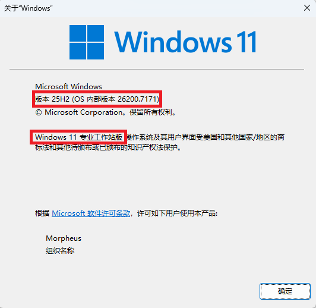

::: tabs

@tab Windows 11 安装媒体

::: tip [Windows 11 安装媒体](https://go.microsoft.com/fwlink/?linkid=2156295)

- [x] Windows更新报错
- [x] 启用或关闭Windows功能出现错误
- [x] 重置系统驱动设置
- [ ] ~~支持LTSC~~

该方法需要下载系统镜像，请在网络良好的情况下使用，重置时间 ==（ > 10min）== 根据系统性能决定

@tab DirectX修复工具增强版

::: tip [DirectX修复工具增强版](https://www.zysoftware.top/post/10.html)

- [x] 解决缺失DLL问题
- [x] 解决C++ Redistributable Package问题
- [x] 重新注册DLL文件

@tab Dism++

::: tip [Dism++](https://github.com/Chuyu-Team/Dism-Multi-language)

- [x] 系统优化
- [x] 回收不必要的系统空间

@tab ZyperWin++

::: tip [ZyperWin++](https://github.com/ZyperWave/ZyperWinOptimize)

- [x] 系统优化

- [x] 关闭系统安全中心

:::

## 离线修复Windows

### 1. 查看电脑版本

1. 按 `Win + R`，输入 `cmd` → 回车，打开命令提示符。
2. 在命令提示符中输入：
   ```cmd
   winver

3. 弹出窗口会显示：

   - Windows 版本（如 Windows 11 家庭/专业版）


   - 系统版本号（如 22H2）


   - 内部版本号（Build Number）

> 

### 2.准备离线修复镜像

1. 下载与你**系统版本一致**的 Windows ISO 文件（点击即可直达）。
   [微软官网(Windows 10【不推荐，只能下载最新的版本】)](https://www.microsoft.com/zh-cn/software-download/windows10)

   [微软官网(Windows 11【不推荐，只能下载最新的版本】)](https://www.microsoft.com/zh-cn/software-download/windows11)

   [MSDN(**需要登录【QQ、百度、支付宝、GitHub、新浪、微软任意一个账号】**)](https://next.itellyou.cn/Original/) P2P下载（ED2K、BT）

   手机下载需要迅雷

2. 下载完成后，双击 ISO 文件进行 挂载。

> 系统会将 ISO 显示为一个虚拟光驱，例如 D:。

### 3.使用 DISM 离线修复系统文件

1. 打开 **命令提示符（管理员）**。

2. 输入以下命令：

```cmd
DISM /Online /Cleanup-Image /RestoreHealth /Source:D:\sources\install.wim /LimitAccess
```

将 `D: `替换为你挂载的 ISO 驱动器盘符。

等待修复完成（可能需要 10-20 分钟）。

完成后，重启电脑。

### 4.SFC 离线扫描

可以在 **命令提示符（管理员）** 下使用：

```cmd
sfc /scannow /offbootdir=C:\ /offwindir=C:\Windows
```

- `/offbootdir` 指向系统分区
- `/offwindir` 指向 Windows 安装目录

> 功能：修复损坏的系统文件，离线可用。
